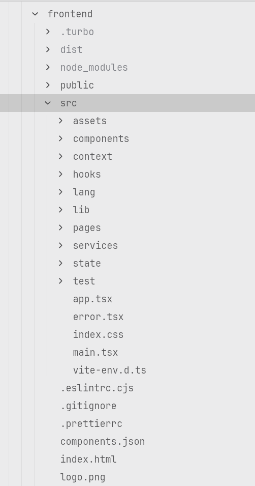
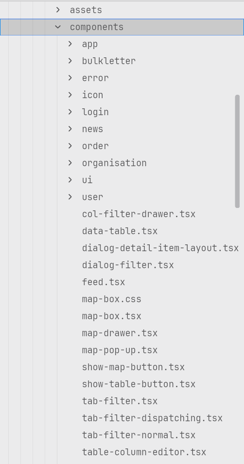
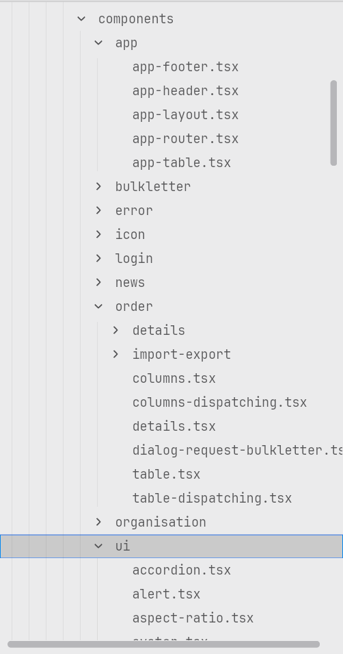
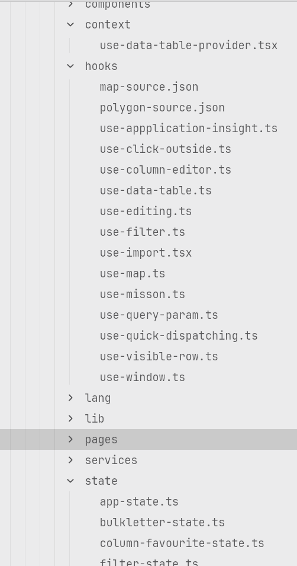
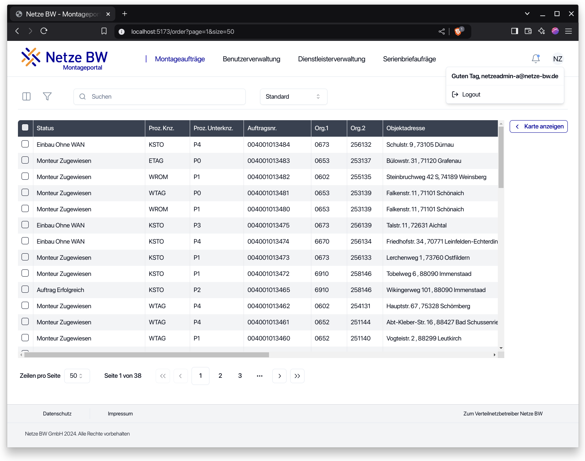
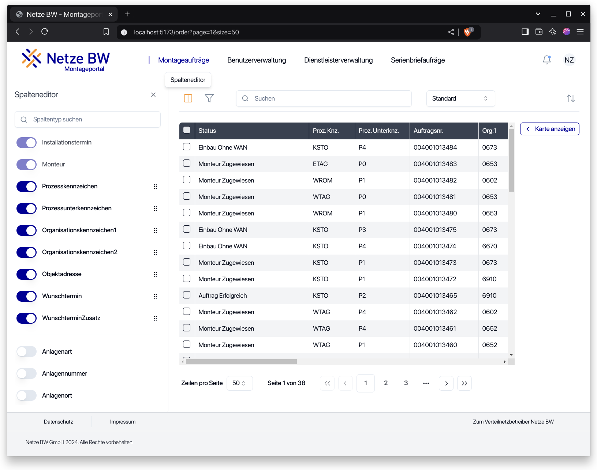
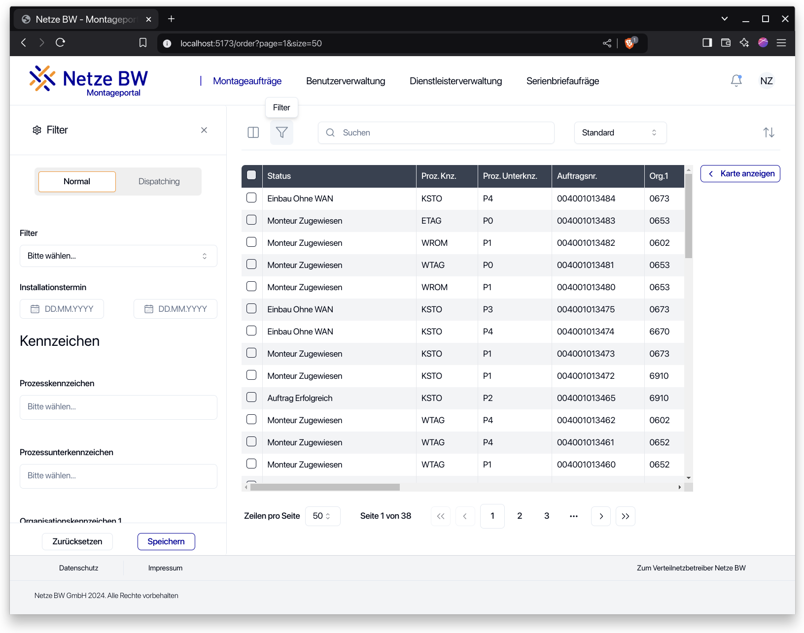
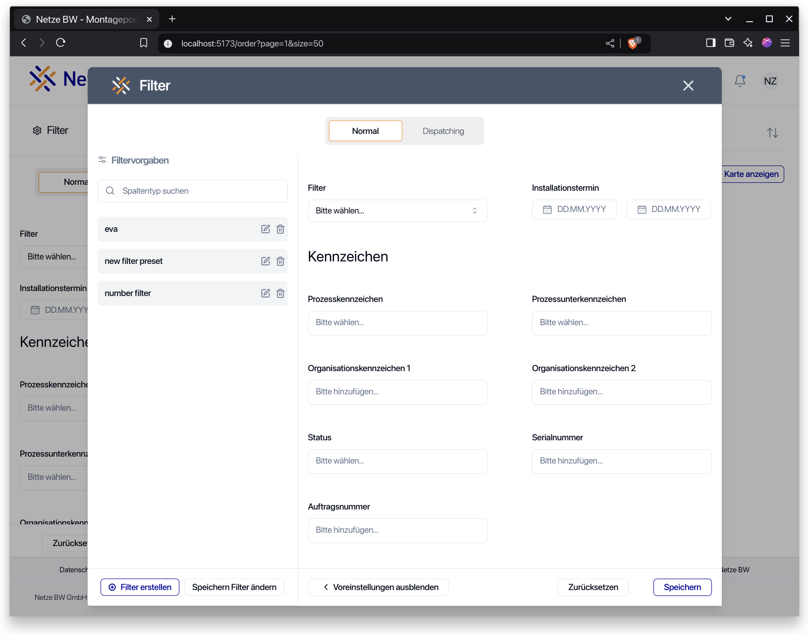
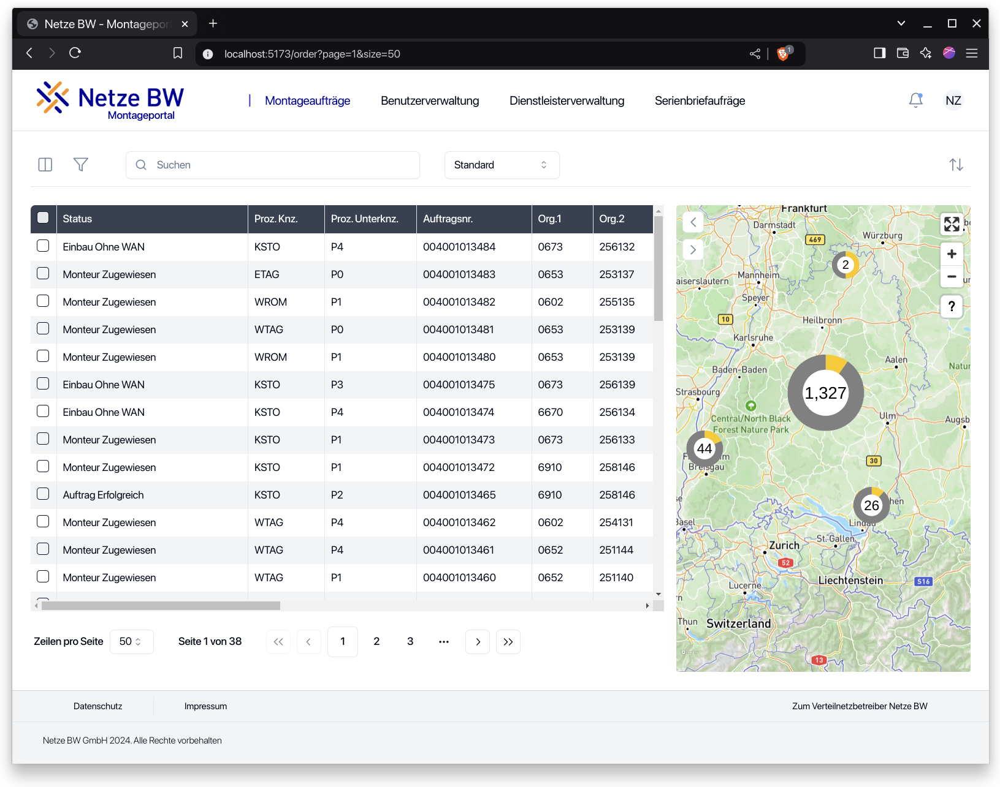
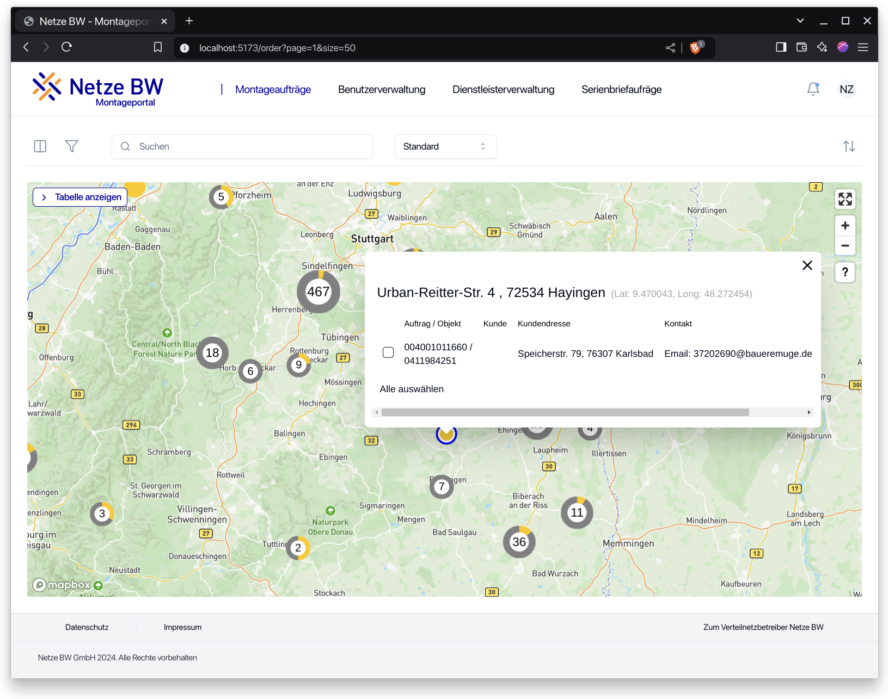

# Frontend Architecture Review: MoPo-S Project

## Project Overview

The MoPo-S project represents a significant migration from Angular 1.x to a modern React application, implemented as a monorepo with a clear separation between frontend and backend services. The architecture demonstrates several strong patterns that support scalability and maintainability:

### Tech Stack
- **Frontend**: React with TypeScript, Vite
- **UI Components**: Shadcn/ui
- **State Management**: Jotai
- **Data Fetching**: TanStack Query
- **Table Management**: TanStack Table
- **Schema Validation**: Zod
- **Routing**: React Router

## Architecture Analysis

### Frontend Structure
The frontend follows a well-organized modular structure:
```
/frontend
  ├── src
  │   ├── assets/
  │   ├── components/
  │   │   ├── [features_name]/
  │   │   └── [commons]/
  │   ├── context/
  │   ├── hooks/
  │   ├── lang/
  │   ├── lib/
  │   ├── pages/
  │   └── state/
  ├── vite.config.js
  ├── tailwind.config.js
  └── tsconfig.json
```






### State Management Implementation

The project uses Jotai for atomic state management, which enables:

1. **Granular Re-rendering Control**: Components only re-render when their specific atoms change
2. **Composable State Logic**: Atoms can depend on other atoms, creating derivations
3. **Clean Separation of Concerns**: Business logic separated from UI components

Example from Order page:
```jsx

const DialogFilterPresetLazy = lazy(() => import('@/components/dialog-filter'));

export default function OrderPage() {
  const [{ data, isLoading: orderLoading }] = useAtom(fetchOrdersAtom);

  // show dialog filter
  const dispatchingFilterState = useAtomValue(dispatchingFilterStateAtom);
  const normalFilterState = useAtomValue(normalFilterStateAtom);

  const queryPageParam = useAtomValue(queryPageParamAtom);

  useAtomValue(fetchAllOrdersAtom);
  return (
    <>
      <OrderTable orderData={data} orderLoading={orderLoading} />
    </>
  );
}
```

## Key Architectural Decisions & Implementations

### 1. Complex Layout Management

The `AppTable` component serves as a flexible layout container that manages multiple interactive elements:

```jsx
export default function AppTable({
  leftDrawer,
  mapDrawer,
  table,
  topAction,
  children,
  showMapButton,
  className,
}: AppTableProps) {
  const { contentHeight } = useWindow();

  return (
    <div className={cn('flex mx-auto')} style={{ height: `${contentHeight}px` }}>
      {leftDrawer}
      <div className={cn('overflow-hidden w-full m-[24px]', className)}>
        {topAction}
        <div className={cn('flex')} style={{ height: `calc(${contentHeight}px - 120px` }}>
          {table}
          {mapDrawer}
          {showMapButton}
        </div>
      </div>
      {children}
    </div>
  );
}
```

**Strengths**:
- Composition-based design allows for flexible layouts
- Dynamic height calculations based on window dimensions
- Clear separation of container from content


### 2. Mapbox Integration

Integration with Mapbox to synchronize table data with map visualizations:

**Architectural Challenges Solved**:
- Synchronizing selected items between table and map
- Handling separate data fetching strategies for map vs. table
- Managing interaction states across components
- Optimizing performance with large datasets in map view


### 3. Global State & Interaction Management

The architecture elegantly handles complex cross-component interactions:

```jsx
const {
  isOpenFilterSheet,
  isOpenFilterDialog,
  isOpenColumn,
  isShowFullMap,
  isShowMap,
  isClickPopupDetail,
  isShowBulkletter,
  isShowBulkletterPopup,
  isOpenImportExport,
  isClientSearch,
  isQuickDispatching,
  isOpenFilterDialog,
} = useAtomValue(appStateUIAtom);
```

**Key Patterns**:
- Centralized UI state management through Jotai atoms
- Conditional rendering based on global state
- Lazy-loaded components for performance optimization
- Memoization to prevent unnecessary re-renders


### 4. Data Fetching Strategy

```ts
export const fetchOrdersAtom = atomWithQuery((get) => {
  const normalFilter = get(normalFilterStateAtom);
  const dispatchingFilter = get(dispatchingFilterStateAtom);
  const currentFilter = get(currentFilterStateAtom);
  const pageParam = get(queryPageParamAtom);

  return {
    queryKey: [
      'installation-orders',
      {
        pageParam,
        normalFilter,
        dispatchingFilter,
      },
    ],
    queryFn: async () => {}
  }
}
````


The implementation uses TanStack Query with dependencies tracking:

```jsx

const ordersClient = useAtomValue(getAllOrdersAtom);

// Example of conditional data source selection
const data = useMemo(() => {
  if (isClientSearch) {
    return ordersClient;
  }
  return orderData?.installationOrders ?? [];
}, [orderData, ordersClient, isClientSearch]);
```

**Strengths**:
- Clean separation of data fetching logic from components
- Smart caching and invalidation strategies
- Conditional data source selection based on application state
- Optimized for both server-side and client-side filtering/searching


### 5. Advanced Table Implementation

The DataTable component leverages TanStack Table for complex data visualization:

```jsx
<DataTableProvider
  data={data ?? []}
  columns={columns}
  columnsVisibility={defaultHiddenColumn}
  <AppTable
    leftDrawer={<LeftDrawer />}
    topAction={
      <TableTopAction
        column={<TableTopAction.Column />}
        filter={<TableTopAction.Filter />}
        search={<TableTopAction.InputSearch />}
        clearOrderSelected={<TableTopAction.ClearOrderSelected />}
        orderDispatching={
          !isShowBulkletter && <TableTopAction.OrderDispatching />
        }
        importExport={<TableTopAction.ImportExport />}
        bulkletter={
          <TableTopAction.Bulkletter defaultHiddenColumn={hiddenColumns} />
        }
        requestLetter={
          isShowBulkletter ? <TableTopAction.RequestLetter /> : null
        }
      />
    }
    table={
      <DataTable
        pagination={{
          show: !isClientSearch ? true : false,
          size: [50, 100, 200, 500, 1000],
        }}
        onClickOnRow={(_, rowOriginal: InstallationOrder) => {
          setIsSelectedRow(true);
          setOrderId(rowOriginal.orderId);
        }}
        isColDnd={true}
        isResize={true}
      />
    }
    mapDrawer={memoizedInitMap}
  </AppTable>
/>
```

**Advanced Features**:
- Column drag-and-drop reordering
- Column visibility toggling
- Custom cell renderers
- Row selection and bulk actions
- Virtual scrolling for large datasets (up to 1000 records)
- Inline editing capabilities
- Row reordering

**main page**


**column edit**


**filter**



**map**



## Architecture Assessment

### Strengths

1. **Modular Component Design**: Clear separation of concerns with components organized by feature and common utilities
2. **Atomic State Management**: Effective use of Jotai for granular, performance-optimized state management
3. **Composable Layouts**: Flexible layout system that adapts to different screen sizes and user interactions
4. **Performance Optimization**: Strategic use of memoization, lazy loading, and virtual rendering
5. **Type Safety**: Comprehensive TypeScript implementation enhances code reliability
6. **Separation of Data and UI**: Clean separation between data fetching, state management, and UI rendering

### Recommendations for Further Enhancement

1. **State Documentation**: Consider documenting the atom dependency graph for easier onboarding
2. **Performance Monitoring**: Implement performance monitoring for critical interactions, especially with large datasets
3. **Component Abstraction**: Further abstract repeated patterns into reusable higher-order components
4. **Test Coverage**: Ensure comprehensive test coverage, especially for complex state interactions
